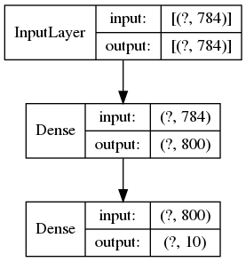

# Neural Network Clothing

**DataSet:**
[Clothing](https://github.com/zalandoresearch/fashion-mnist)


**Python:** v.3.8.2


**Plot model:**




100 epochs --> result: 86,65% correct

## p.s.
Solving the problem with the method ***"plot_model"***:
```bash
$ pip install pydot
$ pip install graphviz
$ sudo apt-get install graphviz
```
